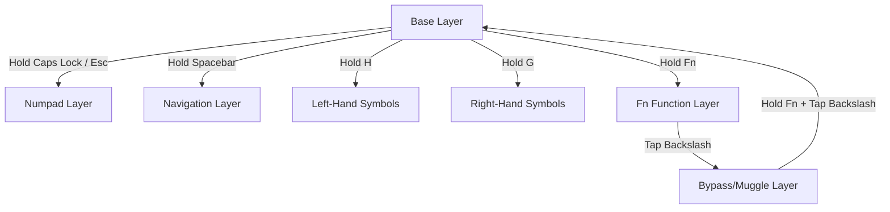

# Kanata 75% Keyboard Keymap Reference

This document maps out the logical layers configured in your [kanata.kbd](file:///Users/me/code/dotfiles/kanata/kanata.kbd) file, using the layout of your **original 75% physical keyboard**. 

---

## Layer Activation & Flow



---

## 1. Default Base Layer (`base`)
* **How Activated:** Default active layer.
* **Special Dual-Role Keys:**
  * **Tab:** Taps as `Tab`, holds as **Hyper** (`Cmd + Alt + Ctrl + Shift`).
  * **Caps Lock:** Taps as `Escape`, holds to activate **Numpad** (`num`).
  * **Spacebar:** Taps as `Space`, holds to activate **Navigation** (`nav`).
  * **G:** Taps as `g`, holds to activate **Right Symbols** (`sym-right`).
  * **H:** Taps as `h`, holds to activate **Left Symbols** (`sym-left`).
  * **Z:** Taps as `z`, holds to activate **Fn Base** (`fn-base`).
  * **Home Row Modifiers:** Taps as character, holds as modifier on opposite-hand presses:
    * `A`/`S`/`D`/`F` $\rightarrow$ `Ctrl`/`Cmd`/`Alt`/`Shift`
    * `J`/`K`/`L`/`;` $\rightarrow$ `Shift`/`Alt`/`Cmd`/`Ctrl`

```text
  ┏━━━━━━━━━━━┳━━━━━━━━━┳━━━━━━━━━┳━━━━━━━━━┳━━━━━━━━━┳━━━━━━━━━┳━━━━━━━━━┳━━━━━━━━━┳━━━━━━━━━┳━━━━━━━━━┳━━━━━━━━━┳━━━━━━━━━┳━━━━━━━━━┳━━━━━━━━┓
  ┃    Esc    ┃ Bright+ ┃ Bright- ┃  MCtrl  ┃   F4    ┃   F5    ┃   F6    ┃  Prev   ┃   ▶︎ ⏸︎   ┃  Next   ┃  Mute   ┃   Vol-  ┃  Vol+   ┃        ┃
  ┣━━━━━━━┳━━━┻━━━━━┳━━━┻━━━━━┳━━━┻━━━━━┳━━━┻━━━━━┳━━━┻━━━━━┳━━━┻━━━━━┳━━━┻━━━━━┳━━━┻━━━━━┳━━━┻━━━━━┳━━━┻━━━━━┳━━━┻━━━━━┳━━━┻━━━━━┳━━━┻━━━━━━━━┫
  ┃   ~   ┃    1    ┃    2    ┃    3    ┃    4    ┃    5    ┃    6    ┃    7    ┃    8    ┃    9    ┃    0    ┃     -   ┃    =    ┃     BKSP   ┃
  ┣━━━━━━━┻━━┳━━━━━━┻━━┳━━━━━━┻━━┳━━━━━━┻━━┳━━━━━━┻━━┳━━━━━━┻━━┳━━━━━━┻━━┳━━━━━━┻━━┳━━━━━━┻━━┳━━━━━━┻━━┳━━━━━━┻━━┳━━━━━━┻━━┳━━━━━━┻━━┳━━━━━━━━━┫
  ┃ Tab/Hypr ┃    Q    ┃    W    ┃    E    ┃    R    ┃    T    ┃    Y    ┃    U    ┃    I    ┃    O    ┃    P    ┃    [    ┃    ]    ┃    \    ┃
  ┣━━━━━━━━━━┻┳━━━━━━━━┻┳━━━━━━━━┻┳━━━━━━━━┻┳━━━━━━━━┻┳━━━━━━━━┻┳━━━━━━━━┻┳━━━━━━━━┻┳━━━━━━━━┻┳━━━━━━━━┻┳━━━━━━━━┻┳━━━━━━━━┻┳━━━━━━━━┻━━━━━━━━━┫
  ┃ Esc/LNUM  ┃  A/Ctrl ┃  S/Cmd  ┃  D/Alt  ┃  F/Shft ┃ G/SymR  ┃ H/SymL  ┃ J/Shft  ┃  K/Alt  ┃  L/Cmd  ┃ ;/Ctrl  ┃    '    ┃      RETURN      ┃
  ┣━━━━━━━━━━━┻━━┳━━━━━━┻━━┳━━━━━━┻━━┳━━━━━━┻━━┳━━━━━━┻━━┳━━━━━━┻━━┳━━━━━━┻━━┳━━━━━━┻━━┳━━━━━━┻━━┳━━━━━━┻━━┳━━━━━━┻━━┳━━━━━━┻━━━━━━━━━━━━━━━━━━┫
  ┃     SHIFT    ┃   Z/Fn  ┃    X    ┃    C    ┃    V    ┃    B    ┃    N    ┃    M    ┃    ,    ┃    .    ┃    /    ┃          SHIFT          ┃ 
  ┣━━━━━━━┳━━━━━━╋━━━━━━━┳━┻━━━━━━━━━╋━━━━━━━━━┻━━━━━━━━━┻━━━━━━━━━┻━━━━━━━━━┻━━━━━━━━━╋━━━━━━━━━┻━┳━━━━━━━┻━┳━━━━━━━┻━━━━━━━━━━━━━━━━━━━━━━━━━┛
  ┃   Fn  ┃ Ctrl ┃  Alt  ┃   Cmd     ┃                Space/Navigation                 ┃   Cmd     ┃   Alt   ┃
  ┗━━━━━━━┻━━━━━━┻━━━━━━━┻━━━━━━━━━━━┻━━━━━━━━━━━━━━━━━━━━━━━━━━━━━━━━━━━━━━━━━━━━━━━━━┻━━━━━━━━━━━┻━━━━━━━━━┛
```

---

## 2. Numpad Layer (`num`)
* **How Activated:** Hold **Caps Lock** (taps as `Esc`).
* **Description:** Turns the top alpha row into a horizontal number line (`1` to `9`) and standard mathematical operators, with navigation and control keys on the right hand. Left hand home row contains Callum-style one-shot modifiers.

```text
  ┏━━━━━━━━━━━┳━━━━━━━━━┳━━━━━━━━━┳━━━━━━━━━┳━━━━━━━━━┳━━━━━━━━━┳━━━━━━━━━┳━━━━━━━━━┳━━━━━━━━━┳━━━━━━━━━┳━━━━━━━━━┳━━━━━━━━━┳━━━━━━━━━┳━━━━━━━━┓
  ┃    _      ┃   F1    ┃   F2    ┃   F3    ┃   F4    ┃   F5    ┃   F6    ┃   F7    ┃   F8    ┃   F9    ┃   F10   ┃   F11   ┃   F12   ┃        ┃
  ┣━━━━━━━┳━━━┻━━━━━┳━━━┻━━━━━┳━━━┻━━━━━┳━━━┻━━━━━┳━━━┻━━━━━┳━━━┻━━━━━┳━━━┻━━━━━┳━━━┻━━━━━┳━━━┻━━━━━┳━━━┻━━━━━┳━━━┻━━━━━┳━━━┻━━━━━┳━━━┻━━━━━━━━┫
  ┃   _   ┃    _    ┃    _    ┃    _    ┃    _    ┃    _    ┃    _    ┃    _    ┃  Div(/) ┃ Mul(*)  ┃ Sub(-)  ┃    _    ┃    _    ┃      _     ┃
  ┣━━━━━━━┻━━┳━━━━━━┻━━┳━━━━━━┻━━┳━━━━━━┻━━┳━━━━━━┻━━┳━━━━━━┻━━┳━━━━━━┻━━┳━━━━━━┻━━┳━━━━━━┻━━┳━━━━━━┻━━┳━━━━━━┻━━┳━━━━━━┻━━┳━━━━━━┻━━┳━━━━━━━━━┫
  ┃   _      ┃    1    ┃    2    ┃    3    ┃    4    ┃    5    ┃    6    ┃    7    ┃    8    ┃    9    ┃ Add(+)  ┃    _    ┃    _    ┃    _    ┃
  ┣━━━━━━━━━━┻┳━━━━━━━━┻┳━━━━━━━━┻┳━━━━━━━━┻┳━━━━━━━━┻┳━━━━━━━━┻┳━━━━━━━━┻┳━━━━━━━━┻┳━━━━━━━━┻┳━━━━━━━━┻┳━━━━━━━━┻┳━━━━━━━━┻┳━━━━━━━━┻━━━━━━━━━┫
  ┃   [LNUM]  ┃   Ctrl  ┃   Alt   ┃  Shift  ┃   Cmd   ┃    _    ┃   Tab   ┃    4    ┃    5    ┃    6    ┃  Return ┃  Bksp   ┃         _        ┃
  ┣━━━━━━━━━━━┻━━┳━━━━━━┻━━┳━━━━━━┻━━┳━━━━━━┻━━┳━━━━━━┻━━┳━━━━━━┻━━┳━━━━━━┻━━┳━━━━━━┻━━┳━━━━━━┻━━┳━━━━━━┻━━┳━━━━━━┻━━┳━━━━━━┻━━━━━━━━━━━━━━━━━━┫
  ┃    _         ┃    _    ┃    _    ┃    _    ┃   000   ┃   ,00   ┃    _    ┃    1    ┃    2    ┃    3    ┃    .    ┃            _            ┃ 
  ┣━━━━━━━┳━━━━━━╋━━━━━━━┳━┻━━━━━━━━━╋━━━━━━━━━┻━━━━━━━━━┻━━━━━━━━━┻━━━━━━━━━┻━━━━━━━━━╋━━━━━━━━━┻━┳━━━━━━━┻━┳━━━━━━━┻━━━━━━━━━━━━━━━━━━━━━━━━━┛
  ┃   _   ┃  _   ┃   _   ┃    _      ┃                      0                          ┃    _      ┃   _     ┃
  ┗━━━━━━━┻━━━━━━┻━━━━━━━┻━━━━━━━━━━━┻━━━━━━━━━━━━━━━━━━━━━━━━━━━━━━━━━━━━━━━━━━━━━━━━━┻━━━━━━━━━━━┻━━━━━━━━━┛
```

---

## 3. Left-Hand Symbols Layer (`sym-left`)
* **How Activated:** Hold **`H`** (tapped as `h`).
* **Description:** Accesses opening brackets (`(`, `{`, `[`) on the home row, and top-row programmers' symbols using only the left hand.

```text
  ┏━━━━━━━━━━━┳━━━━━━━━━┳━━━━━━━━━┳━━━━━━━━━┳━━━━━━━━━┳━━━━━━━━━┳━━━━━━━━━┳━━━━━━━━━┳━━━━━━━━━┳━━━━━━━━━┳━━━━━━━━━┳━━━━━━━━━┳━━━━━━━━━┳━━━━━━━━┓
  ┃           ┃         ┃         ┃         ┃         ┃         ┃         ┃         ┃         ┃         ┃         ┃         ┃         ┃        ┃
  ┣━━━━━━━┳━━━┻━━━━━┳━━━┻━━━━━┳━━━┻━━━━━┳━━━┻━━━━━┳━━━┻━━━━━┳━━━┻━━━━━┳━━━┻━━━━━┳━━━┻━━━━━┳━━━┻━━━━━┳━━━┻━━━━━┳━━━┻━━━━━┳━━━┻━━━━━┳━━━┻━━━━━━━━┫
  ┃       ┃         ┃         ┃         ┃         ┃         ┃         ┃         ┃         ┃         ┃         ┃         ┃         ┃            ┃
  ┣━━━━━━━┻━━┳━━━━━━┻━━┳━━━━━━┻━━┳━━━━━━┻━━┳━━━━━━┻━━┳━━━━━━┻━━┳━━━━━━┻━━┳━━━━━━┻━━┳━━━━━━┻━━┳━━━━━━┻━━┳━━━━━━┻━━┳━━━━━━┻━━┳━━━━━━┻━━┳━━━━━━━━━┫
  ┃          ┃    ~    ┃    @    ┃    #    ┃    $    ┃    %    ┃         ┃         ┃         ┃         ┃         ┃         ┃         ┃         ┃
  ┣━━━━━━━━━━┻┳━━━━━━━━┻┳━━━━━━━━┻┳━━━━━━━━┻┳━━━━━━━━┻┳━━━━━━━━┻┳━━━━━━━━┻┳━━━━━━━━┻┳━━━━━━━━┻┳━━━━━━━━┻┳━━━━━━━━┻┳━━━━━━━━┻┳━━━━━━━━┻━━━━━━━━━┫
  ┃           ┃    (    ┃    {    ┃    [    ┃         ┃         ┃ [SYM_L] ┃  Shift  ┃   Alt   ┃   GUI   ┃  Ctrl   ┃         ┃                  ┃
  ┣━━━━━━━━━━━┻━━┳━━━━━━┻━━┳━━━━━━┻━━┳━━━━━━┻━━┳━━━━━━┻━━┳━━━━━━┻━━┳━━━━━━┻━━┳━━━━━━┻━━┳━━━━━━┻━━┳━━━━━━┻━━┳━━━━━━┻━━┳━━━━━━┻━━━━━━━━━━━━━━━━━━┫
  ┃              ┃    `    ┃    !    ┃         ┃         ┃         ┃         ┃         ┃         ┃         ┃         ┃                         ┃ 
  ┣━━━━━━━┳━━━━━━╋━━━━━━━┳━┻━━━━━━━━━╋━━━━━━━━━┻━━━━━━━━━┻━━━━━━━━━┻━━━━━━━━━┻━━━━━━━━━╋━━━━━━━━━┻━┳━━━━━━━┻━┳━━━━━━━┻━━━━━━━━━━━━━━━━━━━━━━━━━┛
  ┃       ┃      ┃       ┃           ┃                                                 ┃           ┃         ┃
  ┗━━━━━━━┻━━━━━━┻━━━━━━━┻━━━━━━━━━━━┻━━━━━━━━━━━━━━━━━━━━━━━━━━━━━━━━━━━━━━━━━━━━━━━━━┻━━━━━━━━━━━┻━━━━━━━━━┛
```

---

## 4. Right-Hand Symbols Layer (`sym-right`)
* **How Activated:** Hold **`G`** (tapped as `g`).
* **Description:** Accesses closing brackets (`)`, `}`, `]`) on the home row, math operators, and standard programming punctuation using only the right hand.

```text
  ┏━━━━━━━━━━━┳━━━━━━━━━┳━━━━━━━━━┳━━━━━━━━━┳━━━━━━━━━┳━━━━━━━━━┳━━━━━━━━━┳━━━━━━━━━┳━━━━━━━━━┳━━━━━━━━━┳━━━━━━━━━┳━━━━━━━━━┳━━━━━━━━━┳━━━━━━━━┓
  ┃           ┃         ┃         ┃         ┃         ┃         ┃         ┃         ┃         ┃         ┃         ┃         ┃         ┃        ┃
  ┣━━━━━━━┳━━━┻━━━━━┳━━━┻━━━━━┳━━━┻━━━━━┳━━━┻━━━━━┳━━━┻━━━━━┳━━━┻━━━━━┳━━━┻━━━━━┳━━━┻━━━━━┳━━━┻━━━━━┳━━━┻━━━━━┳━━━┻━━━━━┳━━━┻━━━━━┳━━━┻━━━━━━━━┫
  ┃       ┃         ┃         ┃         ┃         ┃         ┃         ┃         ┃         ┃         ┃         ┃         ┃         ┃            ┃
  ┣━━━━━━━┻━━┳━━━━━━┻━━┳━━━━━━┻━━┳━━━━━━┻━━┳━━━━━━┻━━┳━━━━━━┻━━┳━━━━━━┻━━┳━━━━━━┻━━┳━━━━━━┻━━┳━━━━━━┻━━┳━━━━━━┻━━┳━━━━━━┻━━┳━━━━━━┻━━┳━━━━━━━━━┫
  ┃          ┃         ┃         ┃         ┃         ┃         ┃    ^    ┃    &    ┃    *    ┃    -    ┃    =    ┃         ┃         ┃         ┃
  ┣━━━━━━━━━━┻┳━━━━━━━━┻┳━━━━━━━━┻┳━━━━━━━━┻┳━━━━━━━━┻┳━━━━━━━━┻┳━━━━━━━━┻┳━━━━━━━━┻┳━━━━━━━━┻┳━━━━━━━━┻┳━━━━━━━━┻┳━━━━━━━━┻┳━━━━━━━━┻━━━━━━━━━┫
  ┃   [LNUM]  ┃   Ctrl  ┃   Alt   ┃  Shift  ┃   Cmd   ┃ [SYM_R] ┃         ┃         ┃     ]   ┃     }   ┃     )   ┃    \    ┃                  ┃
  ┣━━━━━━━━━━━┻━━┳━━━━━━┻━━┳━━━━━━┻━━┳━━━━━━┻━━┳━━━━━━┻━━┳━━━━━━┻━━┳━━━━━━┻━━┳━━━━━━┻━━┳━━━━━━┻━━┳━━━━━━┻━━┳━━━━━━┻━━┳━━━━━━┻━━━━━━━━━━━━━━━━━━┫
  ┃              ┃         ┃         ┃         ┃         ┃         ┃         ┃         ┃         ┃         ┃         ┃                         ┃ 
  ┣━━━━━━━┳━━━━━━╋━━━━━━━┳━┻━━━━━━━━━╋━━━━━━━━━┻━━━━━━━━━┻━━━━━━━━━┻━━━━━━━━━┻━━━━━━━━━╋━━━━━━━━━┻━┳━━━━━━━┻━┳━━━━━━━┻━━━━━━━━━━━━━━━━━━━━━━━━━┛
  ┃       ┃      ┃       ┃           ┃                                                 ┃           ┃         ┃
  ┗━━━━━━━┻━━━━━━┻━━━━━━━┻━━━━━━━━━━━┻━━━━━━━━━━━━━━━━━━━━━━━━━━━━━━━━━━━━━━━━━━━━━━━━━┻━━━━━━━━━━━┻━━━━━━━━━┛
```

---

## 5. Navigation Layer (`nav`)
* **How Activated:** Hold **Spacebar** (tapped as `space`).
* **Description:** Re-maps the right hand to navigation keys (Arrows, Home, End, PageUp, PageDown) and the left hand to standard modifiers so you can navigate and select text without leaving the home row.

```text
  ┏━━━━━━━━━━━┳━━━━━━━━━┳━━━━━━━━━┳━━━━━━━━━┳━━━━━━━━━┳━━━━━━━━━┳━━━━━━━━━┳━━━━━━━━━┳━━━━━━━━━┳━━━━━━━━━┳━━━━━━━━━┳━━━━━━━━━┳━━━━━━━━┓
  ┃    _      ┃    _    ┃    _    ┃    _    ┃    _    ┃    _    ┃    _    ┃    _    ┃    _    ┃    _    ┃    _    ┃    _    ┃   _    ┃
  ┣━━━━━━━┳━━━┻━━━━━┳━━━┻━━━━━┳━━━┻━━━━━┳━━━┻━━━━━┳━━━┻━━━━━┳━━━┻━━━━━┳━━━┻━━━━━┳━━━┻━━━━━┳━━━┻━━━━━┳━━━┻━━━━━┳━━━┻━━━━━┳━━━┻━━━━━┳━━━━━━━┫
  ┃   _   ┃    _    ┃    _    ┃    _    ┃    _    ┃    _    ┃    _    ┃    _    ┃    _    ┃    _    ┃    _    ┃    _    ┃    _    ┃   _   ┃
  ┣━━━━━━━┻━━┳━━━━━━┻━━┳━━━━━━┻━━┳━━━━━━┻━━┳━━━━━━┻━━┳━━━━━━┻━━┳━━━━━━┻━━┳━━━━━━┻━━┳━━━━━━┻━━┳━━━━━━┻━━┳━━━━━━┻━━┳━━━━━━┻━━┳━━━━━━┻━━┳━━━━━━┫
  ┃   _      ┃  Cmd+Q  ┃  Cmd+W  ┃    _    ┃    _    ┃    _    ┃    _    ┃  Delete ┃   Up    ┃  Bksp   ┃    _    ┃    _    ┃    _    ┃   _   ┃
  ┣━━━━━━━━━━┻┳━━━━━━━━┻┳━━━━━━━━┻┳━━━━━━━━┻┳━━━━━━━━┻┳━━━━━━━━┻┳━━━━━━━━┻┳━━━━━━━━┻┳━━━━━━━━┻┳━━━━━━━━┻┳━━━━━━━━┻┳━━━━━━━━┻┳━━━━━━━━┻━━━━━━┫
  ┃   _       ┃  Ctrl  ┃   Cmd   ┃   Alt   ┃  Shift  ┃    _   ┃   Home  ┃  Left   ┃  Down   ┃  Right  ┃   End   ┃    _    ┃          _             ┃
  ┣━━━━━━━━━━━┻━━┳━━━━━━┻━━┳━━━━━━┻━━┳━━━━━━┻━━┳━━━━━━┻━━┳━━━━━━┻━━┳━━━━━━┻━━┳━━━━━━┻━━┳━━━━━━┻━━┳━━━━━━┻━━┳━━━━━━┻━━┳━━━━━━┻━━━━━━━━━━━━━━━━┫
  ┃    _         ┃    _    ┃  Cmd+X  ┃  Cmd+C  ┃  Cmd+V  ┃    _    ┃  PgUp   ┃  PgDn   ┃    _    ┃  Alt+.  ┃    _    ┃           _            ┃ 
  ┣━━━━━━━┳━━━━━━╋━━━━━━━┳━┻━━━━━━━━━╋━━━━━━━━━┻━━━━━━━━━┻━━━━━━━━━┻━━━━━━━━━┻━━━━━━━━━╋━━━━━━━━━┻━┳━━━━━━━┻━┳━━━━━━━┻━━━━━━━━━━━━━━━━━━━━━━━━┛
  ┃   _   ┃  _   ┃   _   ┃    _      ┃                  Activator                      ┃    _      ┃   _     ┃
  ┗━━━━━━━┻━━━━━━┻━━━━━━━┻━━━━━━━━━━━┻━━━━━━━━━━━━━━━━━━━━━━━━━━━━━━━━━━━━━━━━━━━━━━━━━┻━━━━━━━━━━━┻━━━━━━━━━┛

  ┏━━━━━━━━━━━┳━━━━━━━━━┳━━━━━━━━━┳━━━━━━━━━┳━━━━━━━━━┳━━━━━━━━━┳━━━━━━━━━┳━━━━━━━━━┳━━━━━━━━━┳━━━━━━━━━┳━━━━━━━━━┳━━━━━━━━━┳━━━━━━━━━┳━━━━━━━━┓
  ┃    Esc    ┃   F1    ┃   F2    ┃   F3    ┃   F4    ┃   F5    ┃   F6    ┃    F7   ┃    F8   ┃    F9   ┃   F10   ┃   F11   ┃   F12   ┃  PWR   ┃
  ┣━━━━━━━┳━━━┻━━━━━┳━━━┻━━━━━┳━━━┻━━━━━┳━━━┻━━━━━┳━━━┻━━━━━┳━━━┻━━━━━┳━━━┻━━━━━┳━━━┻━━━━━┳━━━┻━━━━━┳━━━┻━━━━━┳━━━┻━━━━━┳━━━┻━━━━━┳━━━┻━━━━━━━━┫
  ┃   ~   ┃    1    ┃    2    ┃    3    ┃    4    ┃    5    ┃    6    ┃    7    ┃    8    ┃    9    ┃    0    ┃    -    ┃    =    ┃    BKSP    ┃
  ┣━━━━━━━┻━━┳━━━━━━┻━━┳━━━━━━┻━━┳━━━━━━┻━━┳━━━━━━┻━━┳━━━━━━┻━━┳━━━━━━┻━━┳━━━━━━┻━━┳━━━━━━┻━━┳━━━━━━┻━━┳━━━━━━┻━━┳━━━━━━┻━━┳━━━━━━┻━━┳━━━━━━━━━┫
  ┃   Tab    ┃    Q    ┃    W    ┃    E    ┃    R    ┃    T    ┃    Y    ┃    U    ┃    I    ┃    O    ┃    P    ┃    [    ┃    ]    ┃    \    ┃
  ┣━━━━━━━━━━┻┳━━━━━━━━┻┳━━━━━━━━┻┳━━━━━━━━┻┳━━━━━━━━┻┳━━━━━━━━┻┳━━━━━━━━┻┳━━━━━━━━┻┳━━━━━━━━┻┳━━━━━━━━┻┳━━━━━━━━┻┳━━━━━━━━┻┳━━━━━━━━┻━━━━━━━━━┫
  ┃   CAPS    ┃     A   ┃     S   ┃     D   ┃    F    ┃    G    ┃    H    ┃    J    ┃    K    ┃    L    ┃    :    ┃    "    ┃      RETURN      ┃
  ┣━━━━━━━━━━━┻━━┳━━━━━━┻━━┳━━━━━━┻━━┳━━━━━━┻━━┳━━━━━━┻━━┳━━━━━━┻━━┳━━━━━━┻━━┳━━━━━━┻━━┳━━━━━━┻━━┳━━━━━━┻━━┳━━━━━━┻━━┳━━━━━━┻━━━━━━━━━━━━━━━━━━┫
  ┃    SHIFT     ┃    Z    ┃    X    ┃    C    ┃    V    ┃   B     ┃   N     ┃    M    ┃    <    ┃    >    ┃    ?    ┃          SHIFT          ┃ 
  ┣━━━━━━━┳━━━━━━╋━━━━━━━┳━┻━━━━━━━━━╋━━━━━━━━━┻━━━━━━━━━┻━━━━━━━━━┻━━━━━━━━━┻━━━━━━━━━╋━━━━━━━━━┻━┳━━━━━━━┻━┳━━━━━━━┻━━━━━━━━━━━━━━━━━━━━━━━━━┛
  ┃   ƒ   ┃   ^  ┃   ⌥   ┃     ⌘     ┃                  SPACE                          ┃     ⌘     ┃    ⌥    ┃
  ┗━━━━━━━┻━━━━━━┻━━━━━━━┻━━━━━━━━━━━┻━━━━━━━━━━━━━━━━━━━━━━━━━━━━━━━━━━━━━━━━━━━━━━━━━┻━━━━━━━━━━━┻━━━━━━━━━┛
```

---

## 6. Function Row Layer (`fn-base`)
* **How Activated:** Hold **`fn`** (physical bottom-left corner key).
* **Description:** Restores standard `F1`–`F12` row outputs, and maps physical backslash `\` to toggle **Bypass Mode** (`@to_byp`).

```text
  ┏━━━━━━━━━━━┳━━━━━━━━━┳━━━━━━━━━┳━━━━━━━━━┳━━━━━━━━━┳━━━━━━━━━┳━━━━━━━━━┳━━━━━━━━━┳━━━━━━━━━┳━━━━━━━━━┳━━━━━━━━━┳━━━━━━━━━┳━━━━━━━━┓
  ┃    _      ┃   F1    ┃   F2    ┃   F3    ┃   F4    ┃   F5    ┃   F6    ┃   F7    ┃   F8    ┃   F9    ┃   F10   ┃   F11   ┃  F12   ┃
  ┣━━━━━━━┳━━━┻━━━━━┳━━━┻━━━━━┳━━━┻━━━━━┳━━━┻━━━━━┳━━━┻━━━━━┳━━━┻━━━━━┳━━━┻━━━━━┳━━━┻━━━━━┳━━━┻━━━━━┳━━━┻━━━━━┳━━━┻━━━━━┳━━━┻━━━━━┳━━━━━━━┫
  ┃   _   ┃    _    ┃    _    ┃    _    ┃    _    ┃    _    ┃    _    ┃    _    ┃    _    ┃    _    ┃    _    ┃    _    ┃    _    ┃   _   ┃
  ┣━━━━━━━┻━━┳━━━━━━┻━━┳━━━━━━┻━━┳━━━━━━┻━━┳━━━━━━┻━━┳━━━━━━┻━━┳━━━━━━┻━━┳━━━━━━┻━━┳━━━━━━┻━━┳━━━━━━┻━━┳━━━━━━┻━━┳━━━━━━┻━━┳━━━━━━┻━━┳━━━━━━┫
  ┃   _      ┃    _    ┃    _    ┃    _    ┃    _    ┃    _    ┃    _    ┃    _    ┃    _    ┃    _    ┃    _    ┃    _    ┃    _    ┃ToBypas┃
  ┣━━━━━━━━━━┻┳━━━━━━━━┻┳━━━━━━━━┻┳━━━━━━━━┻┳━━━━━━━━┻┳━━━━━━━━┻┳━━━━━━━━┻┳━━━━━━━━┻┳━━━━━━━━┻┳━━━━━━━━┻┳━━━━━━━━┻┳━━━━━━━━┻┳━━━━━━━━┻━━━━━━┫
  ┃   _       ┃    _   ┃    _    ┃    _    ┃    _    ┃    _   ┃    _   ┃    _   ┃    _   ┃    _   ┃    _   ┃    _    ┃          _             ┃
  ┣━━━━━━━━━━━┻━━┳━━━━━━┻━━┳━━━━━━┻━━┳━━━━━━┻━━┳━━━━━━┻━━┳━━━━━━┻━━┳━━━━━━┻━━┳━━━━━━┻━━┳━━━━━━┻━━┳━━━━━━┻━━┳━━━━━━┻━━┳━━━━━━┻━━━━━━━━━━━━━━━━┫
  ┃    _         ┃    _    ┃    _    ┃    _    ┃    _    ┃    _    ┃    _    ┃    _    ┃    _    ┃    _    ┃    _    ┃           _            ┃ 
  ┣━━━━━━━┳━━━━━━╋━━━━━━━┳━┻━━━━━━━━━╋━━━━━━━━━┻━━━━━━━━━┻━━━━━━━━━┻━━━━━━━━━┻━━━━━━━━━╋━━━━━━━━━┻━┳━━━━━━━┻━┳━━━━━━━┻━━━━━━━━━━━━━━━━━━━━━━━━┛
  ┃Activtr┃  _   ┃   _   ┃    _      ┃                      _                          ┃    _      ┃   _     ┃
  ┗━━━━━━━┻━━━━━━┻━━━━━━━┻━━━━━━━━━━━┻━━━━━━━━━━━━━━━━━━━━━━━━━━━━━━━━━━━━━━━━━━━━━━━━━┻━━━━━━━━━━━┻━━━━━━━━━┛
```

---

## 7. Passthrough Bypass Layer (`bypass`)
* **How Activated:** Hold **`fn`** and tap **`\`** (backslash).
* **Description:** Completely bypasses Kanata's layouts, modifiers, and layer-switching. Keyboard behaves exactly like a standard physical keyboard. To switch back to base layer, hold **`fn`** and tap **`\`** again.
