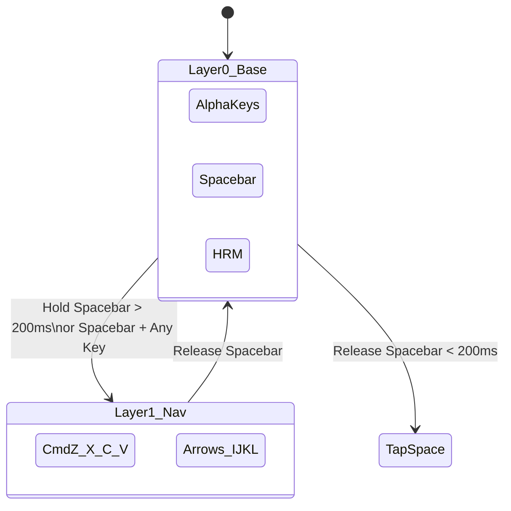

# Technical Specifications: Kanata to QMK

## 1. Global Settings & Timings
To replicate Kanata's timing semantics, the following `#define` flags must be added to `config.h`:

| Setting | QMK Flag | Value | Purpose |
| :--- | :--- | :--- | :--- |
| **Tapping Term** | `TAPPING_TERM` | `200` | Base hold timeout for Home Row Mods and SpaceFn. |
| **Tap-Hold-Press** | `PERMISSIVE_HOLD` | N/A | Ensures Spacebar and HRM activate instantly when combined with another key. |
| **Prior Idle** | `REQUIRE_PRIOR_IDLE` | `150` | Replaces Kanata's `nomods` layer. Prevents HRM misfires during rapid sequential typing. |

## 2. Layer Architecture (Max 8 Layers)
QMK layer enums compile to integers (0-7). The architecture maps as follows:

| Enum | Name | Primary Function | Access Method |
| :--- | :--- | :--- | :--- |
| `0` | `_BASE` | QWERTY base with Home Row Mods | Default |
| `1` | `_NAV` | Arrows (IJKL) and Mac shortcuts | Hold `Spacebar` |
| `2` | `_NUM` | Numpad cluster | Hold `Caps Lock` |
| `3` | `_SYM_L` | Left-hand symbols | Hold `H` (Right Index) |
| `4` | `_SYM_R` | Right-hand symbols | Hold `G` (Left Index) |
| `5` | `_FN` | F-keys (F1-F12) and media controls | Hold `Z` |
| `6` | `_MUGGLE` | Vanilla QWERTY (no tap-holds) | Dedicated Toggle / Shortcut |
| `7` | `_SYS` | Bootloader, layer toggles | Dedicated Toggle / Shortcut |

## 3. Key Mapping Specifications

### 3.1 Home Row Mods (`_BASE` Layer)
Utilize QMK's Mod-Tap (`MT`) functionality for the home row.

| Physical Key | Hand | Tap Action | Hold Action (Modifier) | QMK Keycode |
| :--- | :--- | :--- | :--- | :--- |
| **A** | Left | `A` | Left Control | `LCTL_T(KC_A)` |
| **S** | Left | `S` | Left GUI (Cmd) | `LGUI_T(KC_S)` |
| **D** | Left | `D` | Left Alt (Opt) | `LALT_T(KC_D)` |
| **F** | Left | `F` | Left Shift | `LSFT_T(KC_F)` |
| **J** | Right | `J` | Right Shift | `RSFT_T(KC_J)` |
| **K** | Right | `K` | Right Alt (Opt) | `RALT_T(KC_K)` |
| **L** | Right | `L` | Right GUI (Cmd) | `RGUI_T(KC_L)` |
| **;** | Right | `;` | Right Control | `RCTL_T(KC_SCLN)` |

### 3.2 Layer Activators (`_BASE` Layer)
Utilize QMK's Layer-Tap (`LT`) functionality for layer toggling.

| Physical Key | Tap Action | Hold Action (Layer) | QMK Keycode |
| :--- | :--- | :--- | :--- |
| **Spacebar** | Space | `_NAV` | `LT(_NAV, KC_SPC)` |
| **Caps Lock** | Esc | `_NUM` | `LT(_NUM, KC_ESC)` |
| **G** | `G` | `_SYM_R` | `LT(_SYM_R, KC_G)` |
| **H** | `H` | `_SYM_L` | `LT(_SYM_L, KC_H)` |
| **Z** | `Z` | `_FN` | `LT(_FN, KC_Z)` |
| **Tab** | Tab | Hyper (Ctrl+Alt+Cmd+Shift) | `MEH_T(KC_TAB)` |

### 3.3 Custom Macros
Use `process_record_user` to define the following macros:

| Macro Name | String Output | Use Case |
| :--- | :--- | :--- |
| `MACRO_000` | `000` | Numpad quick zeroes |
| `MACRO_CURRENCY` | `R$ ` | Currency prefix (Brazilian Real) |
| `MACRO_CENTS` | `,00 ` | Currency suffix |

## 4. Layer Transitions (SpaceFn Example)

The following diagram illustrates how the `_BASE` layer transitions to the `_NAV` layer when the Spacebar is held, acting as a "tap-hold-press" override.

